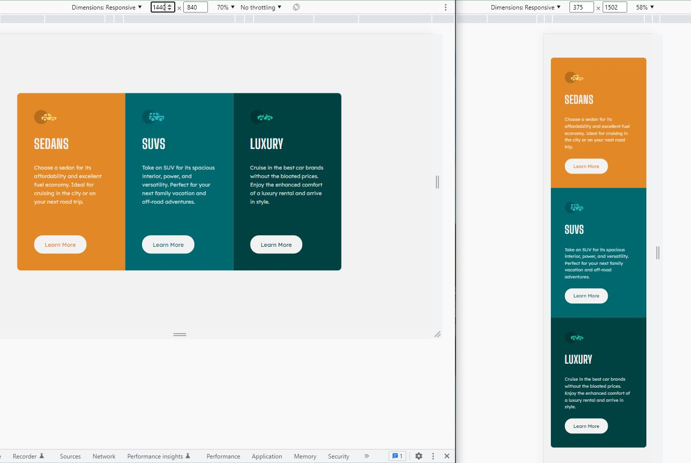

# Frontend Mentor - 3-column preview card component solution

This is a solution to the [3-column preview card component challenge on Frontend Mentor](https://www.frontendmentor.io/challenges/3column-preview-card-component-pH92eAR2-).

## Table of contents

- [Overview](#overview)
  - [The challenge](#the-challenge)
  - [Screenshot](#screenshot)
  - [Links](#links)
- [My process](#my-process)
  - [Workflow](#workflow)
  - [Built with](#built-with)
  - [What I learned](#what-i-learned)
  - [Continued development](#continued-development)
  - [Useful resources](#useful-resources)
- [Author](#author)
- [Acknowledgments](#acknowledgments)

## Overview

### The challenge

Users should be able to:

- View the optimal layout depending on their device's screen size
- See hover states for interactive elements

### Screenshot

### Links

- Solution: [frontendmentor.io](https://www.frontendmentor.io/solutions/3column-preview-card-component-O_DsY6gb2J)
- Live Site: [github.io](https://siavhnz.github.io/frontendmentor/8.3-column-preview-card/index.html)

## My process

### Workflow
 
 - Setting up the workflow
 - Creating HTML skeleton based on design assets `./assets/design/*`
 - Setting up CSS preflight (Prepare reset css, Add Google fonts, Identify CSS custom properties)
 - Working on mobile design
 - Working on Desktop design
 - Write README.md
 - publish on github.io | github.com | frontendmentor.io

### Built with

- Semantic HTML5 markup
- CSS custom properties
- Flexbox
- Mobile-first workflow

### What I learned

`align-items:flex-start;` in `.item` class made all children's width like `button` as it must be (in size of its content)

### Continued development

I will Read and Practice more about Flexbox in the upcoming challenge solution

### Useful resources

 -[Preflight](https://unpkg.com/tailwindcss@3.1.8/src/css/preflight.css) - For reseting HTML elements

 -[Custom CSS properties](https://developer.mozilla.org/en-US/docs/Web/CSS/Using_CSS_custom_properties)

 -[CSS Flexible Box Layout](https://developer.mozilla.org/en-US/docs/Web/CSS/CSS_Flexible_Box_Layout)

## Author

Frontend Mentor - [@siavhnz](https://www.frontendmentor.io/profile/siavhnz)

## Acknowledgments

[Frontendmentor.io](https://www.frontendmentor.io/challenges) - for their Excitement challenges  

[Perfect Pixel](https://chrome.google.com/webstore/detail/perfectpixel-by-welldonec/dkaagdgjmgdmbnecmcefdhjekcoceebi?hl=en) - for such a great extension

